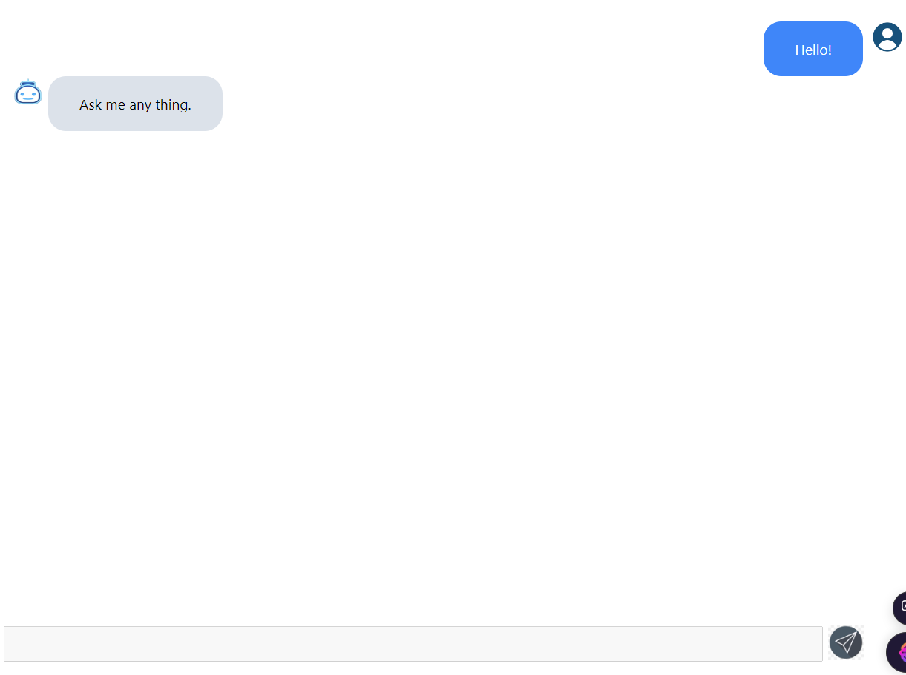

# Simple Chatbot UI

This repository contains a Simple Chatbot UI built using React and Ant Design (AntD). This project serves as a practical example of utilizing the `useWebSocketHook` for efficient communication between a frontend application and a backend service via WebSocket.

## Table of Contents

- [Features](#features)
- [Technologies Used](#technologies-used)
- [Installation](#installation)
- [Usage](#usage)
- [Contributing](#contributing)
- [License](#license)
- [Contact](#contact)
- [UI Preview](#ui-preview)

## Features

- **React and Ant Design:** Built with modern UI components for a clean and responsive design.
- **WebSocket Communication:** Implements `useWebSocketHook` for real-time communication with the backend.
- **Interactive Chat Interface:** Enables straightforward and dynamic interaction for users.
- **Extensible and Customizable:** Easy to expand and modify for various use cases.

## Technologies Used

- React
- Ant Design (AntD)
- JavaScript (ES6+)
- WebSocket API
- useWebSocketHook

## Installation

To get started with the Simple Chatbot UI, follow these steps:

1. **Clone the repository:**

   ```bash
   git clone https://github.com/softdev629/simple-chatbot-client.git
   ```

2. **Navigate to the project directory:**

   ```bash
   cd simple-chatbot-client
   ```

3. **Install dependencies:**

   Make sure you have Node.js and npm installed. Then run:

   ```bash
   npm install
   ```

4. **Start the development server:**

   ```bash
   npm start
   ```

   This will launch the application on `http://localhost:3000` in your default web browser.

## UI Preview  

Below is a preview of the Simple Chatbot UI, showcasing its design and interactive elements built using React and Ant Design.  

  

*Figure: Screenshot of the Chatbot UI in action.*

## Usage

Once the application is running, you can initiate conversations with the chatbot using the UI. The application uses WebSocket to maintain real-time communication with the backend, ensuring fast and responsive interactions.

## Contributing

Contributions are welcome! To contribute to this project:

1. Fork the repository.
2. Create your feature branch (`git checkout -b feature/YourFeature`).
3. Commit your changes (`git commit -m 'Add some feature'`).
4. Push to the branch (`git push origin feature/YourFeature`).
5. Open a pull request.

Please ensure your contributions adhere to the project's coding standards and include test coverage for new functionality.

## License

This project is licensed under the MIT License. Feel free to use and modify the code.

## Contact

For questions, feedback, or further information, please contact Bohdan at [vuongtpv@gmail.com](mailto:vuongtpv@gmail.com).

---

Thank you for exploring the Simple Chatbot UI project! We hope you find it a valuable resource for understanding the use of React and WebSocket in building interactive web applications.